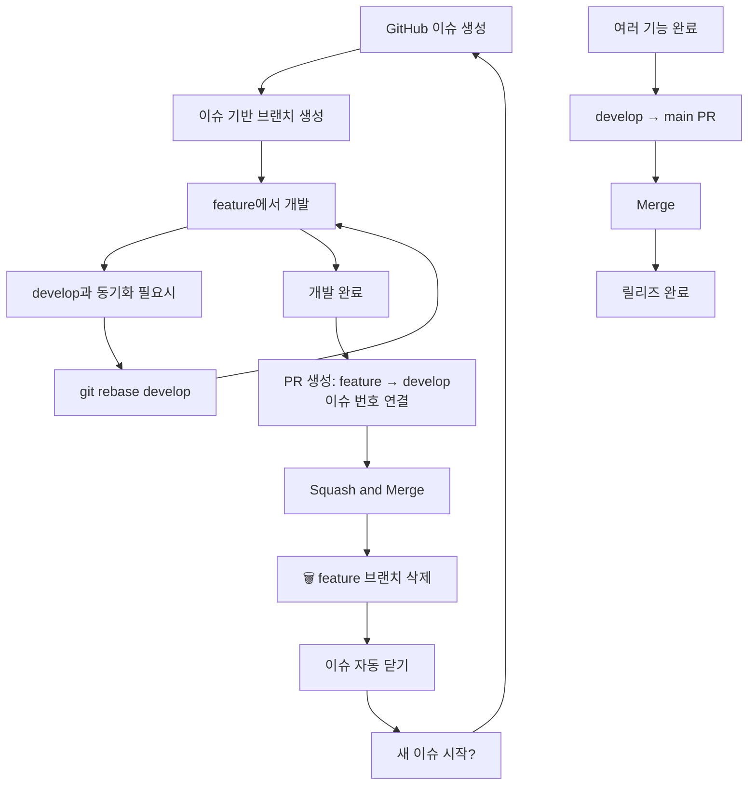

# 팀 Git 브랜치 전략 및 머지 정책 가이드

## 📋 우리 팀의 브랜치 전략

```
main (production) ← develop ← feature/이슈번호-기능명
```

- **main**: 실제 서비스 운영 브랜치 (릴리즈 코드만)
- **develop**: 개발 통합 브랜치 (다음 릴리즈 준비)
- **feature/***: 개별 이슈 단위 개발 브랜치

### 🎯 Issue 기반 브랜치 전략

#### 브랜치 명명 규칙
```bash
feature/123-user-login        # 기능 개발
feature/456-cart-bug-fix      # 버그 수정
hotfix/789-payment-error      # 긴급 수정
```

#### 이슈 크기 가이드
- **적절한 크기**: 1-3일 내 완료 가능한 작업
- **너무 큰 경우**: 여러 이슈로 분할
- **예시**: "로그인 기능" → "로그인 UI", "인증 API 연동", "에러 처리"

## 🔒 GitHub Ruleset 정책

### develop으로의 PR: **Squash and Merge만 허용**
- feature/* → develop PR 시 자동으로 squash merge 적용
- 여러 개의 작업 커밋들이 하나의 깔끔한 커밋으로 합쳐짐

### main으로의 PR: **Merge만 허용**
- develop → main PR 시 일반 merge 적용
- 릴리즈 히스토리가 명확하게 보존됨

## 🚀 실무 워크플로우

### 1. 새 기능 개발 시작

```bash
# GitHub에서 이슈 생성 및 할당받기
# 이슈 번호 확인 (예: #123)

# develop에서 최신 코드 받기
git checkout develop
git pull origin develop

# 이슈 기반 feature 브랜치 생성
git checkout -b feature/123-login-page
```

### 2. 개발 중 develop 동기화 (권장)

```bash
# develop 최신 변경사항 가져오기
git checkout develop
git pull origin develop

# feature 브랜치로 돌아와서 rebase
git checkout feature/123-login-page
git rebase develop
```

> **💡 Tip**: 충돌이 발생하면 파일을 수정하고 `git rebase --continue`

### 3. PR 생성 및 머지

#### feature/* → develop PR
1. GitHub에서 PR 생성
2. **PR 제목**: `feat: 사용자 로그인 페이지 구현 (#123)`
3. **PR 본문에 이슈 연결**: `Closes #123`
4. 리뷰 완료 후 **"Squash and merge"** 버튼 클릭
5. 커밋 메시지를 의미있게 수정

#### develop → main PR (릴리즈 시)
1. develop → main PR 생성
2. 릴리즈 준비 완료 후 **"Merge pull request"** 버튼 클릭
3. 릴리즈 태그 추가 권장

## 📊 각 머지 방식의 결과

### Squash and Merge (feature → develop)
**Before:**
```
feature/123-login: A---B---C---D
                  /
develop:        ...
```

**After:**
```
feature/123-login: A---B---C---D
                  /
develop:        ...---X (A+B+C+D가 합쳐진 새로운 커밋)
```

### Merge (develop → main)
**Before:**
```
develop: X---Y---Z (여러 기능들)
```

**After (main에서):**
```
main: ... -----------M (릴리즈 v1.2.0)
                    /
develop: X---Y---Z
```

## ⚠️ 주의사항

### ✅ 권장사항
- GitHub 이슈를 먼저 생성하고 브랜치 이름에 이슈 번호 포함
- feature 브랜치에서 자주 커밋하세요 (어차피 squash됩니다)
- PR 제목에 이슈 번호를 포함하고, 본문에 `Closes #이슈번호` 추가
- develop에서 정기적으로 rebase하여 충돌을 미리 해결하세요
- 적절한 이슈 크기: 1-3일 내 완료 가능한 작업 단위

### ❌ 피해야 할 것
- feature 브랜치를 여러 사람이 동시에 작업하지 마세요
- main 브랜치에서 직접 작업하지 마세요
- develop 브랜치에서 직접 작업하지 마세요

## 🗑️ Squash Merge 후 feature 브랜치 처리

### ⚠️ 중요: feature 브랜치는 일회용입니다!

**Squash and merge 후 상황:**
```bash
# merge 전
feature/123-login: A---B---C---D
develop:           ... --- X

# squash merge 후  
feature/123-login: A---B---C---D (여전히 존재하지만 의미 없음)
develop:           ... --- X --- Y (Y = A+B+C+D가 합쳐진 새로운 커밋)
```

### 📋 올바른 처리 방법

#### 1단계: feature 브랜치 삭제
```bash
# 로컬에서 삭제
git branch -d feature/123-login

# 원격에서도 삭제 (GitHub에서 자동 삭제 안된 경우)
git push origin --delete feature/123-login
```

#### 2단계: 새 이슈 작업 시 새로운 브랜치 생성
```bash
# develop 최신 상태로 업데이트
git checkout develop
git pull origin develop

# 새 이슈를 위한 feature 브랜치 생성
git checkout -b feature/124-logout-feature
```

### ❌ 절대 하지 말아야 할 것

```bash
# 🚫 기존 feature 브랜치에서 계속 작업하지 마세요!
git checkout feature/123-login  # 이미 merge된 브랜치
git rebase develop              # 충돌과 혼란만 가중됨
```

**왜 안되나요?**
- feature의 A,B,C,D 커밋과 develop의 Y 커밋은 다른 커밋입니다
- Git이 같은 변경사항을 중복으로 인식해서 충돌 발생
- 히스토리가 꼬여서 복구가 어려워집니다

### 🔧 이미 기존 브랜치에서 작업했다면?

#### 방법 1: 변경사항을 새 브랜치로 이동 (권장)
```bash
# 현재 작업 내용 임시 저장
git stash

# develop에서 새 브랜치 생성 (새 이슈 번호 사용)
git checkout develop
git pull origin develop
git checkout -b feature/125-login-enhancement

# 작업 내용 복원
git stash pop
```

#### 방법 2: 강제로 develop 기준으로 리셋 (주의!)
```bash
git checkout feature/123-login
git reset --hard develop
# 이전 작업한 내용은 모두 사라짐!
```

### 🔄 올바른 브랜치 생명주기



## 📝 커밋 메시지 가이드

### feature 브랜치에서 (자유롭게)
```
로그인 UI 추가
API 연결
버그 수정
```

### PR 제목 (squash 커밋이 됨)
```
feat: 사용자 로그인 기능 구현 (#123)
fix: 장바구니 계산 오류 수정 (#456)
docs: API 문서 업데이트 (#789)
```

### 이슈 연결
```markdown
PR 본문에 추가:
Closes #123
Fixes #456
Resolves #789
```

## 🆘 문제 해결

### Q: Rebase 중 충돌이 발생했어요
```bash
# 충돌 파일 수정 후
git add .
git rebase --continue

# 또는 rebase 취소하고 merge 사용
git rebase --abort
git merge develop
```

### Q: 실수로 잘못된 브랜치에서 작업했어요
```bash
# 현재 변경사항을 임시 저장
git stash

# 올바른 브랜치로 이동
git checkout correct-branch

# 변경사항 복원
git stash pop
```

### Q: feature 브랜치를 삭제해도 되나요?
- **반드시 삭제해야 합니다!** squash merge 된 feature 브랜치는 의미가 없어집니다
- GitHub에서 PR 머지 시 자동 삭제 옵션을 켜두는 것을 권장합니다

### Q: 실수로 merge된 feature 브랜치에서 계속 작업했어요
```bash
# 변경사항을 새 이슈/브랜치로 옮기기
git stash
git checkout develop
git pull origin develop
git checkout -b feature/새이슈번호-기능명
git stash pop
```

### Q: 같은 기능을 계속 개발하고 싶어요
- 절대로 같은 feature 브랜치를 재사용하지 마세요
- GitHub에서 새 이슈를 만들어 새 브랜치를 사용하세요
- 관련 이슈들은 라벨이나 마일스톤으로 그룹화하세요

### Q: 이슈 크기를 어떻게 정해야 하나요?
- **적절한 크기**: 1-3일 내 완료 가능
- **너무 큰 경우**: 여러 이슈로 분할
- **예시**: "사용자 관리" → "로그인 구현 #123", "회원가입 구현 #124"

